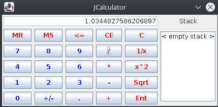

## Rapport Laboratoire Calculatrice 
###### Adam Zouari, Guillaume Blanco & Zied Naimi


#### Choix d'implémentation :
-	Nous avons créé ( en plus de l'état interne State, de l'interface graphique et de l'interface console) 4 classes héritant de la classe Operator. Ces 4 classes( BinaryOperator qui s'occupe de toute les opérations binaire ( +, -, *, /) qui sont des sous-classes (Add, Substract, Multiply, Divide), UnaryOperator qui s'occupe de toutes les opérations unaire (1/x, x^2, Sqrt, +/-) qui sont des sous-classes(Inverse, Square, SquareRoot, MoreLess), MemoryOperation qui s'occupe de modifier l'état interne (C, CE, Enter, MS, MR) qui sont des sous-classes ayant le même nom et pour finir NumberCreation qui s'occupe de "créer" notre nombre (à l'affichage). Les classes héritant de NumberCreation sont Dot (.), Number (0,1,2,3,4,5,6,7,8,9) et Backspace (<=). Il y a pour finir une classe ExitOperator qui ne sert qu'au mode console et permet de sortir du programme.

-	State contient (en plus de la stack, d'un attribut permettant de stocker une valeur en mémoire et un booleen permettant de savoir si la valeur courante est "évalué" (résultat d'une opération ou d'une sauvegarde)) 2 variables importante. Qui sont input qui gère le nombre au format string et calculVal qui récupère la valeur stocker dans input pour effectuer les calculs.

- Nous avons décidé de mettre MoreLess dans unary Operation car pour nous l'opposé est une opération mathématique ( *-1). Nous n'avons donc pas exactement le même affichage que vous ( si on fait un +/- sur 4, on aura -4.0) mais cela nous paraît juste au niveau mathématique. Nous avons créer une fonction qui nous permet de supprimer les .0 inutile mais avons décidé de ne pas l'utiliser car le choix nous a été laissé libre.
- La fonction :

```
String SuppZero(double number) 
{
	double fraction = number - (int) number;  
	return (fraction != 0) ? String.valueOf(number) : String.valueOf((int) number);  
}
 ```

-	Nous avons décidé de mettre le Backspace dans NumberCreation car il ne sert que pour l'affichage ce n'est donc pas vraiment une opération
-	Nous avons décidé de traité l'exception de la stack vide lors d'une opération en ne faisant rien (pas mettre "Error" dans la valeur courante) car c'est une erreur plutôt courante et nous pensons que cela pourrait gêné l'expérience utilisateur.
-	Il se peut que calculVal et input n'ait pas la même valeur en tout temps car calculVal n'est utilisée que lors des calculs
-	Nous avons gérer les erreurs de calcul en se basant sur le fait que Java gère les calculs. Nous partons du principe que l'infinie est une valeur cohérente. Nous gérons seulement le cas NaN que nous remplaçons par un "Error" à l'affichage. 
-	Nous avons décidé qu'après un MemoryStore la valeur serait pusher sur la stack si nous recommencions à écrire un nombre (comme votre implémentation)
-	On a décidé de faire une grille de test plutôt qu'un main car on a un mode graphique qui ne s'apprête pas vraiment à un main de test (la même chose pour le mode console). 

#### Tests effectués :  

- Tester avec de très gros chiffre - c'est Java qui gère ce genre de problème (Ex :infinity)
- Tester de faire un Backspace sur une valeur évalué - Ne fais rien
- Tester de faire un Backspace sur le un chiffre - Le chiffre se transforme en 0
- Ajouter un point lorsqu'on a déjà un chiffre à virgule - Empêche le 2ème point
- Ajouter un chiffre alors qu'un 0 est dans la valeur courante - Remplace le 0 par le chiffre
- Ecrire un chiffre alors que la valeur courante est une valeur "évalué" - push la valeur sur la stack
- Ecrire un chiffre après un MS - push la valeur sur la stack
- Ajouter un point à une valeur évalué - push sur la stack 
- Faire une opération quand la stack est vide - Ne fait rien ( expliqué plus haut)
- Test de toutes les opérations

- Test de reproductibilité des exemples de la donnée :
	- Mode Console : 


	- Mode Interface Graphique

